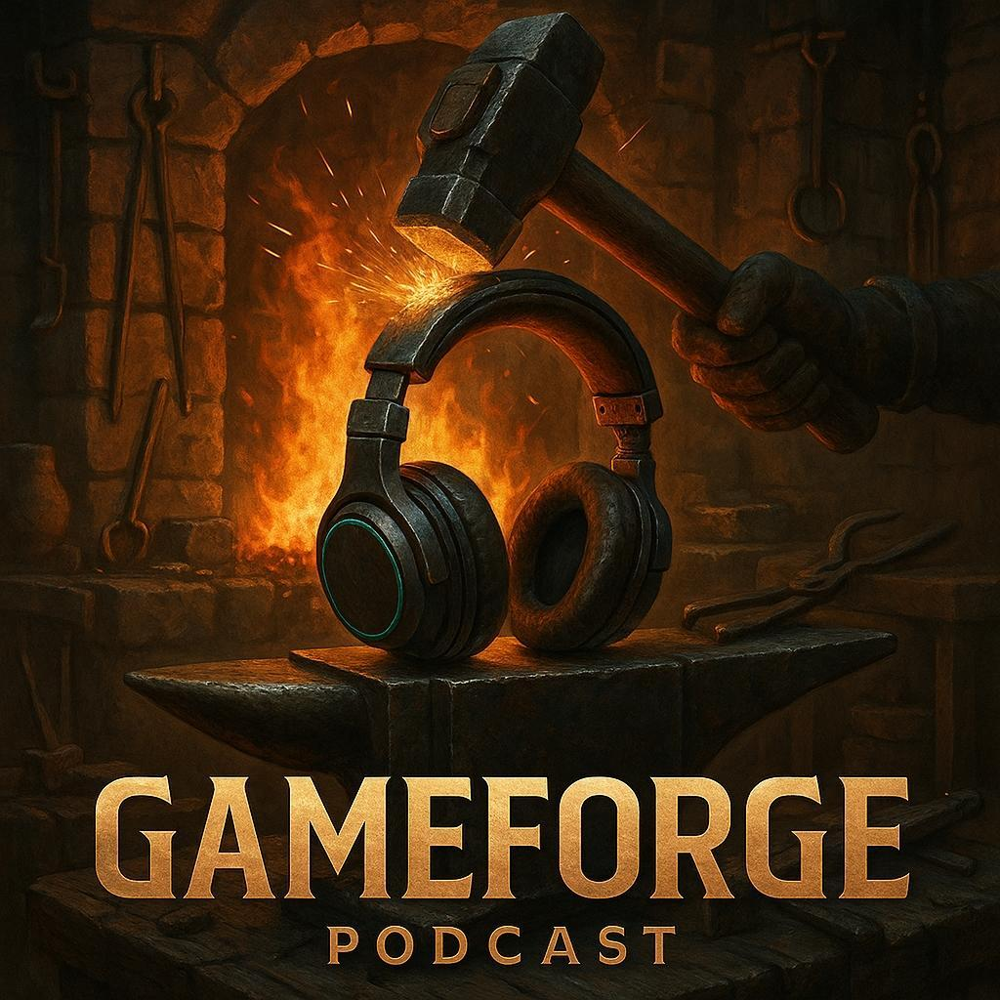

    preview do podcast

    <audio src="output/podcast_editado.MP3" controls title="Podcast editado"></audio>

# Projeto Podcast Gerado por I.A.s

 > ℹ️ **NOTA:** Este repositório é um fork do repositório do Felipão da Dio, com ajustes para refletir o Podcast criado por mim seguindo as aulas do curso.

Projeto com o objetivo de gerar um podcast utilizando ferramentas de IA através de prompts mais trabalhado.

Utilizar uma esteira de prompts para gerar cada etapa do processo criativo.

## 💻 Tecnologias utilizadas no projeto

- [ChatGPT](https://chat.openai.com/) 
- [MidJourney](https://www.midjourney.com/app/)
- [ElevenLabs](https://beta.elevenlabs.io/)
- [Capcut](https://www.capcut.com/pt-br/)

## ✨ Como foi feito ?

- Roteiro gerado via chatgpt
- Audio gerado pela elevenLabs
- Chat GPT para criar as capas (Ao invés do MidJourney)
- Capcut para tratar aúdio e adicionar sons de fundo

## 🛠️ Prompts com a Instruções de execução
- Nome do PodCast:
-- Você é um roteirista de podcast, vamos criar um podcast de tecnologia focado no desenvolvimento de jogos eu gostaria de sua ajuda para criar 5 sugestões de nomes criativos para um podcast de uma comunidade composta por desenvolvedores iniciantes e avançados, artistas visuais e de áudio, designers de jogos e roteiristas de jogos, o podcast deve ter algum trocadilho nerd no nome.

O podcast dará dicas de desenvolvimento de jogos, falando sobre engines, processos de gestão, ferramentas de arte e áudio, tecnologias disruptivas, Inteligência Artificial no contexto de jogos, etc.

{REGRAS}
> O nome deve ser enxuto, um nome e um subtítulo
> O nome tenha algum trocadilho nerd com nomes de franquias conhecidas de jogos medievais
> O nome deve conter alguma palavra forte que remeta à Guild
> Crie variações do título e sub-título
{REGRAS NEGATIVAS}
> Não quero que o nome tenha palavras muito complexas
> Não quero que utilize palavras que remetam à Java, frontend, apostas
> Não use palavras em inglês no nome do PodCast

>> Guild Forge 
- O lugar da criação dos jogos e magia digital.
- Ideias e ferramentas para moldar seus próprios mundos.
- Onde cada episódio é um item lendário na sua bagagem de game dev.

- Após a seleção do nome GameForge, criação do logo:
-- Crie um logo para o Podcast utilizando elementos medievais e modernos, que remetam à idéia do Podcast com um fone de ouvido como elemento central.

- Criando um Roteiro para o episódio:
- Você é um roteirista de pod cast de tecnologia focado no desenvolvimento de jogos cujo nome é "Game Forge - onde as ideias viram jogos" e tem foco em desenvolvedores iniciantes, artistas visuais e de áudio, designers de jogos e roteiristas de jogos.
o formato do roteiro deve ser:
[Introdução]
[Curiosidade 1]
[Curiosidade 2]
[Finalização]

{Regras}
* no bloco [Introdução] crie uma introdução chamativa, destacando a participação da comunidade GameGuild como muito importante para o podcast, crie um texto parecido com as introduções dos vídeos do canal "ei nerd" mas focado no desenvolvimento de jogos.
* no bloco [Curiosidade 1] substitua por uma curiosidade sobre Game Engines
* no bloco [Curiosidade 1] substitua por uma curiosidade sobre Ferramentas de Gestão
* no bloco [Finalização] crie uma despedida amigável e inclua algo como "Eu sou o BudaSurtado e a gente se vê no próximo episódio."
* use termos simples
* o podcast deve ter entre 10 e 15 minutos
* o podcast vai ter como apresentador o Budasurtado e um convidado 
{Regras negativas}
* não use termos técnicos
* não use palavras complexas
